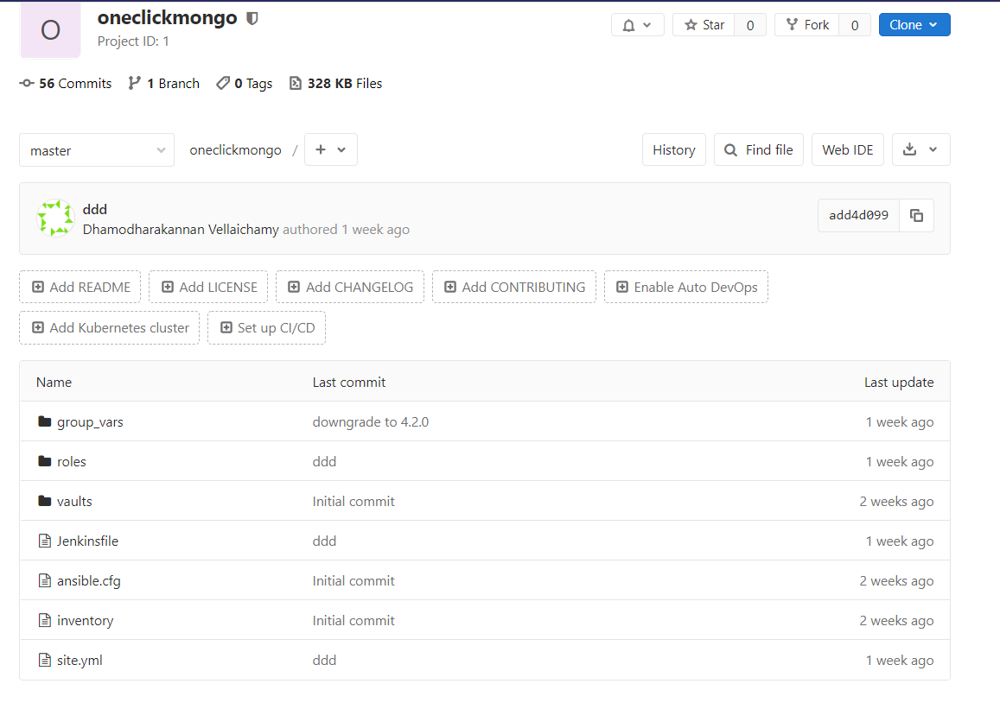
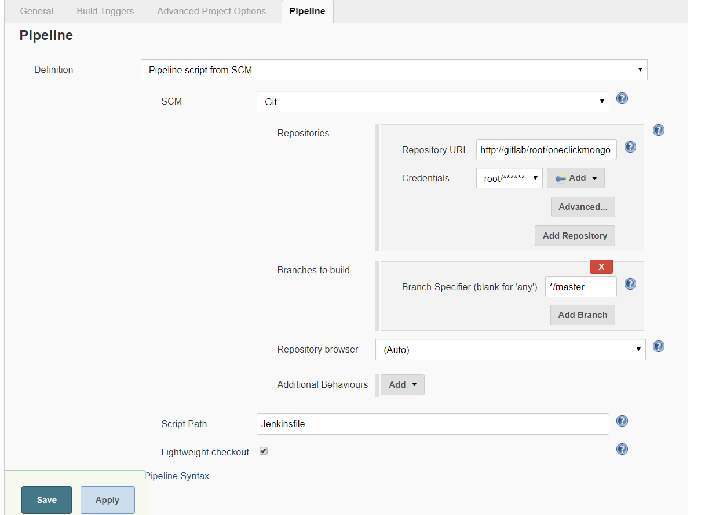

CICD for deploying MongoDB cluster
##################################

Step by step guide for deploying MongoDB cluster with CICD on your machine

Tools
*****
- Docker
- Ansible
- Git (Gitlab)
- Jenkins

How to Setup environments
*************************

Prerequisites
=============
- Download required version of MongoDB rpms and store it under src/mongo/<<version>>
- Create rootCA and node certificates with openssl and store it under src/certs/<<version>>

Docker
======
#. Install docker for desktop
#. Create a external docker network with bridge driver::

    $ docker network create mongonetwork
#. Create external volumes for gitlab & jenkins::

    $ docker volume create jenkins_home
    $ docker volume create gitlab_config
    $ docker volume create gitlab_logs
    $ docker volume create gitlab_data

#. Build *centos:base* & *jenkins* images from respective docker files::

    $ docker build -t centos:base -f Dockerfiles/centos-base.Dockerfile .
    $ docker build -t jenkins:latest -f Dockerfiles/jenkins.Dockerfile .

#. Start the containers with docker-compose::

    $ docker-compose up

#. Start other required services::

    $ ./start_services.bat

Gitlab
======

#. Setup gitlab root password on first time
#. Setup a gitlab project
#. Download and push the ansibleplaybooks section

Jenkins
=======
#. Setup a jenkins project
#. Enable webhook from gitlab

